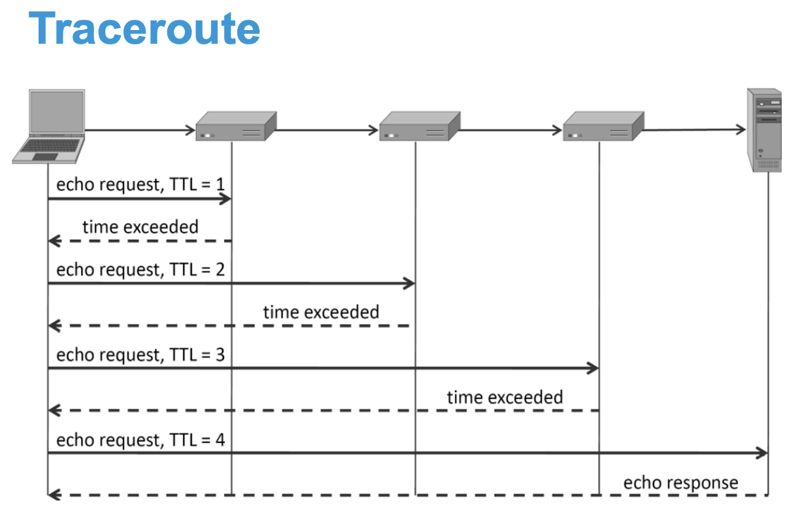

# Network Layer Security

F20AN Week 2, Finn Wohner's Notes

### Outline

- Overview of the network layer
- IPv4 Packets
- IPv4 Addressing & Subnetting
- IP Vulnerabilities
- ICMP Protocol
- ICMP Attacks

## The Network Layer

The Internet Protocol is a connectionless protocol, where each packet is sent independently from one another.

Network infrastructure is considered inherently unreliable at any single network element or transmission medium and is dynamic is terms of the availability of links and nodes.

As such, Internet Protocol (IP) has the following characteristics.
- Delivery on a best effort basis (unreliable).
- No acknowledgments.
- Packets may be lost, reordered, corrupted or duplicated.

IP packets encapsulate packets from the transport layer such as Transmission Control Protocol (TCP) or User Datagram Protocol (UDP).

### IPv4 Packet Format

| Layer | Version | IHL | DSCP | ECN | Total Length | Identification | Flags | Fragment Offset | TTL | Protocol | Header Checksum | Source Address | Destination Address | Options | Data | |
 --- | --- | --- | --- | --- | --- | --- | --- | --- | --- | --- | --- | --- | --- | --- | --- | --- |
 | Length (bits) | 4 | 4 | 6 | 2 | 16 | 16 | 3 | 13 | 8 | 8 | 16 | 32 | 32 | up to 288 |

 #### Version

 Four bit version field, for IPv4 it is set to 4.

 #### Internet Header Length (IHL)

 Due to the options field the IPv4 header is variable in size. The IHL field contains the size of the IPv4 header in intervals of 32 bit words. I.e., the minimum size for this field is 5 and the maximum is 15.

 #### Differentiated Services Code Point (DSCP)

 Originally Type of Service (ToS), this field specifies differentiated services. Real time data streaming makes use of the DSCP field.

 #### Explicit Congestion Notification (ECN)

 The field allows end-to-end notification of network congestion without dropping packets. ECN is an optional feature available when both endpoints support it and effective when also supported by the underlying network.

 #### Total Length

 This 16-bit field defines the entire packet size in bytes, including header and data. The minimum size is 20 bytes (header without data) and the maximum is 65,535 bytes.

 All hosts are required to be capable of reassembling datagrams of size up to 576 bytes, but most modern hosts handle much larger packets.

 Links may impose further restrictions on packet size, in which case datagrams must be fragmented.

 Fragmentation performed in IPv4 is performed in either the sending host or in routers. Reassembly in performed at the receiving host.

 #### Identification

 This field is primarily used for uniquely identifying the group of fragments of a single IP datagram. Some experimental work has suggested using the ID field for other purposes, such as for adding packet-tracing information to help trace datagrams with spoofed source addresses, but any such use in now prohibited.

 #### Flags

 A three bit field that is used to control or identify fragments. They are (in order from most significant to least significant).
 1. Bit 0: Reserved, must be zero.
 2. Bit 1: Don't Fragment (DF).
 3. Bit 2: More Fragments (MF).

If the DF flag is set, and fragmentation is required to route the packet, the packet is dropped. This can be used when sending packets to a host that does not have resources to perform reassembly of fragments. It can also be used for path MTU discovery, either automatically by the host IP software, or manually using diagnostic tools such as ping or traceroute.

For unfragmented packets, the MF flag is cleared. For fragmented packets, all fragments except the last have the MF flag set. The last fragment has a non-zero Fragment Offset field, differentiating is from an unfragmented packet.

#### Fragment Offset

This 13 bit field specifies the offset of a particular fragment relative to the beginning of the original unfragmented IP datagram.

The fragment offset value for the first fragment is always 0. Fragments are specified in units of 8 bytes, which is why the fragment length must be a multiple of 8.

#### Time To Live (TTL)

Used to prevent network failure in the event of a routing loop. Specified in seconds, but time intervals less than 1 second are rounded up to 1.

In practice this is used as a hop count, when the datagram arrives at a router, the router decrements the TTL field by one.

When the TTL field hits zero, the router discards the packet and typically sends an ICMP time exceeded message to the sender.

The traceroute program sends messages with adjusted TTL values and uses these ICMP time exceeded messages to identify the routers traversed by packets from the source to the destination.

#### Protocol

This field defines the protocol used in the data portion of the IP datagram. Some examples are:
- 1: ICMP
- 6: TCP
- 17: UDP

#### Header Checksum

Used for error checking of the header. When a packet arrives at a router or its destination, the network device calculates the checksum of the header including the checksum field. A value of 0xFFFF is expected. IF a different result is obtained, the device discards the packet.

Errors in the data portion of the packet are handled separately by the encapsulated protocol. Both UDP and TCP have separate checksums that apply to their data.

When a packet's TTL field is updated by a router, the router must calculate a new header checksum for the packet.

The checksum is the 16 bit one's complement of the one's complement sum of all the 16 bit words in the header.

#### Source Address

32 bit field for the IPv4 address of the sender of the packet. It may be changed in transit by Network Address Translation (NAT).

#### Destination Address

32 bit field for the IPv4 address of the receiver of the packet. It may also be affected by Network Address Translation (NAT).

#### Options

The options field is not often used.

Packets containing some options may be considered as dangerous by some routers and be blocked.

The list of options may be terminated with the option EOOL (End of Options List, 0x00), this is considered necessary if the end of the options would not coincide with the end of the header.

### IP Addresses

ICANN (Internet Corporation for Assigned Names and Numbers) is a nonprofit organization that allocates IP address space, and manages top level domains.

IPv4 address are 32 bit whilst IPv6 addresses are 128 bit.

#### Private Addresses

A private network is a network that uses a private address space of IP addresses. These are commonly used for LAN addressing.

They are not allocated to any specific organization and anyone may use these addresses without approval.

There are a couple of private address ranges, including 1 class A network, 16 (contiguous) class B networks, and 256 class C networks.

- 10.0.0.0/8 (10.0.0.0 to 10.255.255.255).
- 172.16.0.0/12 (172.16.0.0 to 172.31.255.255)
- 192.168.0.0/16 (192.168.0.0 to 192.168.255.255)

#### Network Masks

An IP address is always associated with a network mask. I.e.,
- IP: 196.168.1.1
- Mask: 255.255.255.0
- CIDR Notation (IP & Mask): 192.168.1.1/24

The mask separates the network identifier from the rest by performing IP AND Mask

Two addresses are in the same network if their network ID are the same (IP1 AND Mask1 == IP2 AND Mask2).

Packets do not need to be routed when they're in the same network, and can just be sent with a switch.

#### Subnetting

An address can be subdivided into a network, subnet and host.

Subnetting is to divide a network into logically separated, smaller networks.
- Logically: Subnets are connected to the same switch.
- Separated: Two machines from different subnets don't see each other on the same LAN (must be routed to communicate).

There are 2^n possible subnets for n bits.

In practice:
- Size: Generally try to have less than 200 hosts per LAN
- Separation: Different subnets for VoIP (QoS Issue), security/critical machines, and to separate end-users from the server.

##### How to Subnet

Example: Divide network 192.168.1.0 into 2 subnets. The initial subnet (for Class C network addresses) is 255.255.255.0, without subnetting, network would have 254 hosts (1-254). We take the original host part (0 in this case) and borrow a few bits to define a new subnet.

1. Calculate the size of each of two subnets where n = number of subnets.
    - 256*(1/2^n-1) = 128 for 2 subnets
2. Range of subnets is 0-127 and 128 - 255
    - Subnet 1: 00000000 to 01111111.
    - Subnet 2: 10000000 to 11111111.
3. Most significant bit identifies network, so add it to the network ID.
    - Subnet 1: 192.168.1.00000000 or 192.168.1.0
    - Subnet 2: 192.168.1.10000000 or 192.168.1.128.

The subnet broadcast addresses are still all the host bits replaced with 1s, so:
    - Subnet 1: 192.168.1.01111111 or 192.168.1.127
    - Subnet 2: 192.168.1.1111111 or 192.168.1.255

A subnet mask is a variable length subnet mask (VLSM) which is different from class masks.

### Internet Routing

A router bridges two or more networks, it operates at the network layer and maintains tables to forward packets to the appropriate network. Forwarding decisions are based solely on the destination address.

A routing table maps ranges of addresses to LANs or other gateway routers.

Every connected host needs to understand where it can route packets so that it can send and receive packets. Various commands can be used to investigate the routes and connections that are open at a particular host.
- `ip addr` (formerly `ifconfig`) to show my ip address.
- `ip route` (formerly `route -n`) to show the routing table information.

Private networks are not routed outside of a LAN.

### Static vs Dynamic IP Address

A static IP address is manually set along with a subnet mask and usually a default gateway.

Hosts can be configured to dynamically get an IP address along with a subnet mask and default gateway using Dynamic Host Configuration Protocol (DHCP). A host runs a DHCP client and a DHCP server provides the address information.

DHCP server can be a router, firewall, or home access point.

#### DHCP 4-way-handshake

1. Discovery: The client looks for DHCP servers.
2. Offer: One or more DHCP server suggests IP Addresses
3. Request: Choose one and contact the DHCP server
4. Acknowledge: The server confirms the chosen address.

### IP Vulnerabilities

1. Unencrypted transmission, eavesdropping possible at any intermediate host during routing.
2. Reconnaissance, gathering network information e.g., with ping.
3. No source authentication, sender can spoof source address, making it difficult to trace packet back to attacker.
4. No integrity checking, entire packet, header and payload can be modified while enroute to destination, enabling content forgeries, redirections and man in the middle attacks.
5. No bandwidth constraints, a large amount of packets can be injected into network to launch DoS attack via flooding, broadcast addresses provide additional leverage.
6. Vulnerable to malformed packets, i.e., ping-of-death.

### ICMP (Internet Control Message Protocol)

A protocol that is used for network testing and debugging. They are simple messages encapsulated in a single IP packet, however it is considered as being on the network layer.

ICMP defines a a set of error messages that are sent back to the source of the original IP packet.

Some reasons for rejecting IP packets include:
- TTL equals 0.
- Error in IP header checksum.
- Destination unreachable.

Note: Tools for administration and diagnostics are often used for attacks.

#### ICMP Packet

| Layer | Type | Code | Checksum | Rest of Header | Data |
| --- | --- | --- | --- | --- | --- |
| Length (octets) | 1 | 1 | 2 | 4 | ... |

##### Type

The ICMP type, some examples are:
- 0: Echo reply.
- 1 and 2: Reserved.
- 3: Destination unreachable.
- 8: Echo request.
- 9: Router advertisement.
- 11: Time Exceeded.
- ...

##### Code

ICMP subtype, each ICMP type may have a code associated with it, for example:
- Echo Reply.
    - 0: Default.
- Destination Unreachable:
    - 0: Destination network unreachable.
    - 1: Destination host unreachable.
    - 2: Destination protocol unreachable.
    - 3: Destination port unreachable.
    - 4: Fragmentation needed and DF set.
    - ... up to 15.

##### Checksum

Internet checksum for error checking, calculated from the ICMP header and data with value 0 substituted for this field.

##### Rest of Header

Four byte field, contents vary based on the ICMP type and code.

##### Data

ICMP messages contain a data section that includes a copy of the entire IPv4 header plus at least the first 8 bytes of the data from the IPv4 packet that caused the error. This is because it is assumed the a higher level protocol that uses port numbers stores that data in the first 8 bytes of the original packet's data.

#### Tools Based on ICMP

- Ping: Sends a series of echo request messages and provides statistics on roundtrip times and packet loss.
- Traceroute: Sends a series of ICMP packets with increasing TTL values to discover routes.

##### Ping

Ping is implemented using ICMP messages of Type 8 and Type 0, Echo request and Echo reply.

It is used by attackers as a reconnaissance tool to map a target's network.

Echo messages are sent to a computer on a network, if the host sends back an echo reply, the attacker knows of the host's existence. Network admins can block incoming ICMP data on their network's firewalls.

##### Traceroute

#### ICMP Attacks

##### Simple DoS

An attacker forges an "unreachable address" or "time exceeded message" and sends it to one or both parties of a communication, resulting in a broken connection.

Parties can reinitialize the connection, though with some overhead.

##### Ping of Death

ICMP specifies that messages must fit a single IP packet (64Kb).

PoD sends a ping packet that exceeds the maximum size using IP fragmentation.

The reassembled packet causes several operating systems to crash due to a buffer overflow.

Systems aware of the attack can easily detect a ping of death.

##### Smurf

Also known as ICMP packet magnification, a ping (echo request) to a broadcast address using a spoofed source address of the victim.

Many spoofed ping messages are sent by the attacker in order to be effective.

All hosts on the network respond (echo reply) to the victim, consuming the victim's bandwidth (a DoS attack).

The countermeasure is to ignore pings to broadcast addresses.

##### ICMP Redirect

A feature of ICMP that allows routers to send routing information to hosts.
1. Host uses gateway R1 to reach all destinations.
2. If host is also connected to gateway R2, and R1 knows that R2 is more effective at routing to a particular destination, R1 can send an ICMP message to let the host know to use R2.

Type 5 (redirect message) with Code 0 (redirect datagrams for the network) or Code 1 (redirect datagrams for the host).

It allows hosts to learn which networks are reachable through which routers on the local network segment.

Redirect messages also permit an attack in which routing tables can be sabotaged. E.g., Winfreez attack on Windows involved telling machine X that the shortest path to Y starts with X (circular path).

#### Attacks Using ICMP Payload

##### Covert Channels

A covert channel involves using communication protocols outside of their intended purpose in order to exchange information.

For example, implementations are free to put whatever they choose in the payload portion of echo packets. Hence, the packets can be used to (covertly) exchange information. Loki was a tool to do this.

##### DoS

Used to be possible to include a DoS payload in a ping

- `ping -p 2b2b2b415448300 victim`

Payload is hex for +++ATH0, the modem hang up string, the victim's echo reply contains the payload, and would cause them to drop the connection.