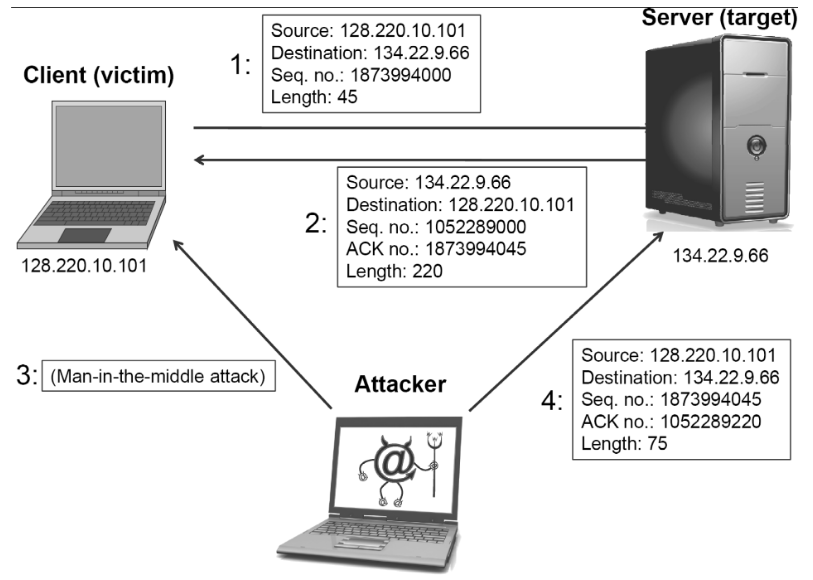
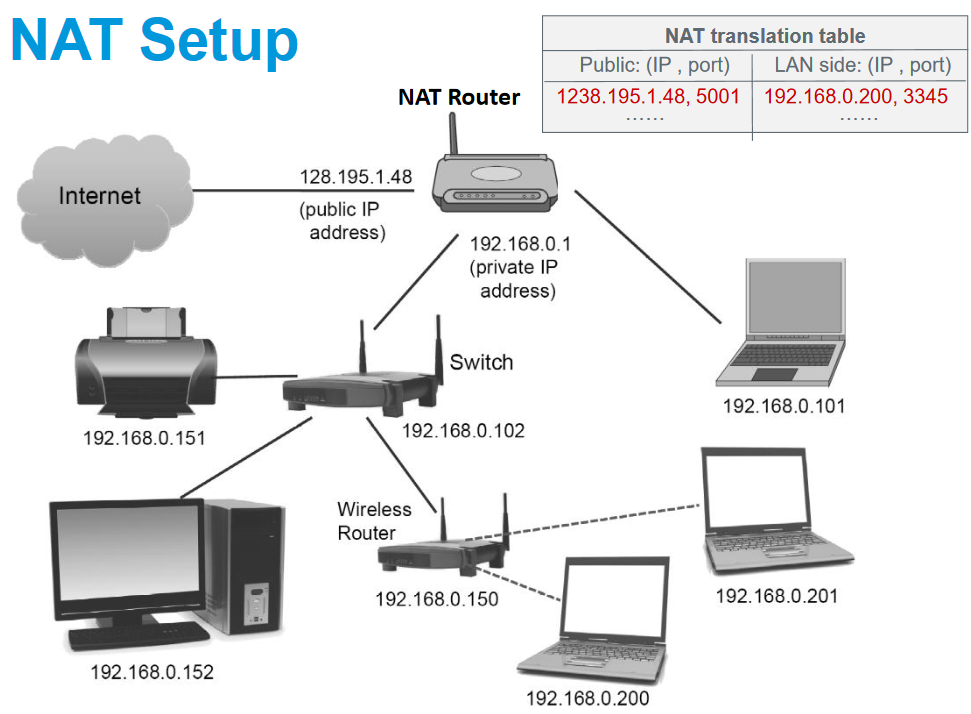

# Transport Layer Security

F20AN Week 3, Finn Wohner's Notes

### Outline

- Overview of the Transport Layer
- TCP Protocol
- TCP Attacks and Countermeasures
- UDP Protocol
- UDP Vulnerabilities and Countermeasures
- Network Address Translation

## The Transport Layer

The two most important transport layer protocols are TCP and UDP.
- TCP: Provides a reliable and ordered communication channel between applications.
- UDP: Lightweight protocol with lower overhead and can be used for applications that do not require reliability or communication order.

### Transmission Control Protocol (TCP)

Transmission Control Protocol (TCP) is a core protocol of the Internet protocol suite. It provides host-to-host communication services for applications, and supports multiple concurrent applications on the same server. It accomplishes this by having ports, 16 bit numbers identifying where data is directed.

#### TCP Ports

TCP identifies the destination application (demultiplexing) using port numbers. The TCP header includes space for both source and destination port numbers.

Ports 0 through 1023 are reserved for use by known protocols.
Ports 1024 through 49151 are known as user ports, used by most user programs for listening to connections.
Ports 49152 through 65535 are private ports used for temporary or private ports.

#### TCP Packet Format

| Layer | Source Port | Destination Port | Sequence Number | Acknowledgment Number | Offset | Reserved | Flags | Window Size | Checksum | Urgent Pointer | Options | Data |
| --- | --- | --- | --- | --- | --- | --- | --- | --- | --- | --- | --- | --- |
| Length (octets) | 2 | 2 | 4 | 4 | 1/2 | 1/2 | 1 | 2 | 2 | 2 | 0 - 40 (in intervals of 4) | 0 - 65535 |

##### Source Port

Identifies the sending port.

##### Destination Port

Identifies the receiving port

##### Sequence Number

This field has two roles:
1. If the SYN flag is set (1), then this is the initial sequence number. The sequence number of the actual first data byte and the acknowledged number in the corresponding ACK are then this sequence number plus 1.
2. If the SYN flag is unset (0), then this is the accumulated sequence number of the first data byte of this segment for the current session.

##### Acknowledgment Number

If the ACK flag is set then the value of this field is the next sequence number that the sender of the ACK is expecting. This acknowledges receipt of all prior bytes (if any). The first ACK sent by each end acknowledges the other end's initial sequence number itself, but no data.

##### Data Offset

Specifies the size of the TCP header in 32-bit words. The minimum size header is 5 words and the maximum is 15 words, thus giving the minimum size of 20 bytes and a maximum of 60 bytes, allowing for up to 40 bytes of options in the header. This field gets its name from the fact that it is also the offset from the start of the TCP segment to the actual data.

##### Reserved

For future use and should be set to 0. Senders should not use these and receivers should ignore them if set, in the absence of further specification and implementation.

##### Flags

Contains 8 1-bit flags (control bits) as follows:
1. CWR (Congestion Window Reduced): Set by the sending host to indicate that it received a TCP segment with the ECE flag set and had responded in congestion control mechanism.
2. ECE (ECN-Echo): Has a duel role depending on the value of the SYN flag:
    - If the SYN flag is set (1), the TCP peer is ECN capable.
    - If the SYN flag is unset (0), a packet with the Congestion Experienced flag set (ECN=11) in its IP header was received during normal transmission. This serves as an indication of network congestion (or impending congestion) to the TCP sender.
3. URG: Indicates that the Urgent pointer field is significant.
4. ACK: Indicates the the acknowledgment field is significant. All packets after the initial SYN packet sent by the client should have this flag set.
5. PSH: Push function. Asks to push the buffered data to the receiving application.
6. RST: Reset the connection.
7. SYN: Synchronize sequence numbers. Only the first packet sent from each end should have this flag set. Some other flags and fields change meaning based on this flag, and some are only valid when it's set and others when it's clear.
8. FIN: Last packet from sender.

##### Window Size

The size of the receive window, which specifies the number of window size units that the sender of this segment is currently willing to receive.

##### Checksum

The 16-bit checksum field is used for error-checking of the TCP header, the payload and an IP pseudo header. The pseudo header consists of the source IP address, the destination IP address, the protocol number for the TCP protocol (6) and the length of the TCP headers and payload (in bytes).

##### Urgent Pointer

If the URG flag is set, then this 16-bit field is an offset from the sequence number indicating the last urgent data byte.

##### Options (Variable 0-320 bits, in intervals of 32 bits)

The length of this field is determined by the data offset field. This document will not specify the options field, however more can be read [here](https://en.wikipedia.org/wiki/Transmission_Control_Protocol).

##### Padding

The TCP header padding is used to ensure that the TCP header ends, and data begins, on a 32-bit boundary. The padding is composed of zeroes.

#### Establishing TCP Connections

TCP connections are established through a three-way-handshake.

The server generally has a passive listener, waiting for a connection request. The client requests a connection by sending out a SYN packet, the server responds by sending a SYN/ACK packet, indicating an acknowledgment for the connection. The client responds by sending an ACK to the server thus establishing connection.

When the server receives the initial SYN packet, it uses TCB (Transmission Control Block) to store the information about the connection. This is called a half-open connection as only client-server connection is confirmed.

The server stores the TCB in a queue that is only for the half-open connections. After the server gets ACK packet, it will take this TCB out of the queue and store it in a different place. If ACK doesn't arrive, the server will resend SYN+ACK packet. The TCB will eventually be discarded after a certain time period.

#### SYN Flood Attack

The SYN flood attack is a denial-of-service attack, and can be combined with another attack such as TCP hijacking.

It relies on sending TCP connection requests faster than the server can process them. The attacker creates a large number of packets with spoofed source IP addresses and setting the SYN flag.

The server responds with a SYN/ACK for which it never gets a response (waits about 3 minutes for each). Eventually the server stops accepting connection requests, thus triggering a denial of service.

##### Countermeasures: SYN Cookies

After a server receives a SYN packet, it calculates a keyed hash (H) from the information in the packet using a secret key that is only known to the server. This hash (H) is sent to the client as the initial sequence number from the server. H is called a SYN cookie.

The server will not store the half-open connection in its queue. If the client is an attacker H will not reach the attacker.

If the client is not an attacker, it sends H+1 in the acknowledgment field, the server checks if the number in the acknowledgment field is valid or not by recalculating the cookie.

#### Ending a TCP Connection

##### Using FIN Flag

1. A sends out a FIN packet to B.
2. B replies with an ACK packet. This closes the A to B communication.
3. B sends out a FIN packet to A.
4. A replies with an ACK packet. This closes the B to A communication.

##### Using Reset Flag

One of the parties sends a RST packet to immediately break the connection.

#### TCP Reset Attack

This attack aims to break up a TCP connection between A and B using a spoofed RST packet. It may also be exploited to implement a DOS attack by flooding the victim with RST packets, or by blindly TCP reset attacking.

##### Countermeasure

The TCP security enhancement is enabled by default, meaning the RST packet is subject to the following rules.
- If the RST bit is set and the sequence number is outside the expected window, silently drops the segment.
- If the RST bit is exactly the next expected sequence number, the device resets the connection.
- If the RST bit is set and the sequence number does not exactly match the next expected sequence value, but is within the acceptable window, the device sends an acknowledgment (ACK).

#### SEQ and ACK Numbers

The TCP handshake establishes the sequence (SEQ) and acknowledgement (ACK) numbers for both communicating hosts.
- Each starting number is typically randomly chosen for each session.
- The numbers are only offsets from the random starting points chosen by each host.

After the handshake, each number is incremented according to the number of bytes sent and received between the hosts. Note that both sides maintain their own point of view on the sequence and acknowledgment numbers.
- SEQ: The number of bytes I have sent (before the current send).
- ACK: The sequence number of the next bytes I am expecting.

***PUT EXAMPLE HERE**

##### Note on Wireshark

In wireshark, with relative sequence numbering, the end of the handshake should result in seq=1 and ack=1 on both sides. In reality the numbers are only offsets from the random starting points chosen by each host (which is why you turn off relative sequence numbering to create a fake packet).

#### TCP Session Hijacking

An attempt to take control of a TCP session. Sessions are the server keeping state of a client's connection. Servers need to keep track of messages sent between client and the server and their respective actions.

IP spoofing is one type of hijacking on a large network. IP spoofing is an attempt by an intruder to send packets from one IP address that appear to originate from another.
- Session hijacking (man-in-the-middle).
- Impersonation, e.g., if authentication is d one by filtering IP address.
- DoS attack, e.g., attacker sends many packets (possibly using DDoS) with source address of victim.

The basic idea involves changing the source IP address in a packet. The TCP/IP Protocol requires that acknowledgment numbers be sent across sessions, this makes sure that the client is getting the server's packets and vice versa. To hijack a session you would need to have the right sequence of acknowledgment numbers (sequence number prediction).

##### Blind IP Spoofing

The attacker transmits multiple packets to their intended target to receive a series of numbers which are generally used to assemble packets in the order in which they intended to read the packets. I.e., in the order of packet 1 to be read first, then packet 2, and then packet 3.

In this attack, the hacker is not aware of how the transmissions take place on this network so they need to coax the machine into responding to their own requests so that they can analyze the sequence numbers. Now the attacker can inject data into the stream of packets without having authenticated themselves when the connection was first established.

##### Non-Blind IP Spoofing

In this attack the hacker resides on the same subnet as their intended target so that  they are aware of the sequence of packets.

##### TCP Session Hijacking Countermeasures

TCP Session Hijacking can be counter-measured with multiple methods.

- Ingress Packet Filtering: Packets coming from outside the network with a source address from inside the network are filtered (not allowed).
    - Prevents external users from spoofing internal addresses.
    - A common attack to attempt to circumvent firewalls.
- Egress Packet Filtering: Outgoing packets with an external source address are filtered.
    - Prevent internal users from spoofing external addresses.
- Encryption and authentication
    - Encryption can be used to protect information gathering, e.g., IP addresses, sequence numbers.
    - Authentication, based on more than just an IP address, can reduce likelihood of acceptance of packets from non-authenticated entities.
    - Both are default in IPv6.

### User Datagram Protocol (UDP)

UDP is a stateless, unreliable datagram protocol built on top of IP. It does not provide delivery guarantees, order, or acknowledgments, but delivery is significantly faster.

Can distinguish data for multiple concurrent applications on a single host. The applications take full responsibility for errors and data loss.
- Some application level protocols such as TFTP build reliability on top of UDP.
- DNS: Normal hosts query DNS servers using UDP.
- Voice-over-IP (VoIP): Streaming video and audio all might use UDP.

UDP supports broadcasting.

#### UDP Fraggle Attack

UDP provides an Echo service which responds to the Echo requests
- Port 7.
- Inverses the source and destination.
- For testing and measuring round trips.

It is similar to the Network Layer's IP's Smurf attack. The attacker broadcasts a UDP Echo spoofing the victim's IP address, all the receivers send replies to the victim and the victim is overwhelmed.

#### UDP CharGEN Service Attack

UDP provides a character generator service (CharGEN).
- Port 19.
- When it receives a message it replies with a random number (1 to 512) of characters.
- Intended for tests and measurements.
- Exists as well on TCP: Data is sent from the server while a connection on port 19 is open, until the client closes it.

The CharGEN amplification attack is performed by sending small packets from the victim's spoofed IP address to network devices running the CharGEN service. An attacker can send a spoofed CharGEN request with a broadcast address as a source. This generates a UDP flood to the victim's machine.

#### UDP Ping Pong Attack

The attacker sends a spoofed CharGEN request to a host, where the spoofed address is the victim's address. The source port is set to 7 (port 7 is listening for echo requests).

The host replies with a random character to victim on port 7, an echo reply is generated by the victim and is sent BACK to port 19 on the host. This creates an infinite loop of echo/charGEN messages.

The attack can be done with many hosts "CharGENing" the same victim address. This generates a large amount of traffic on the network and performs a DoS attack on the victim's machine.

### Network Address Translation

Network Address Translation is a solution to the IPv4 address shortage, several devices may share the same address.

It also has security benefits by hiding internal addresses.

An access point / router has two interfaces.
- A public interface: Facing the internet, has the public IP address.
- A private interface: Facing the internal network, with a private address (the default gateway for the network).

NAT provides a function that fuses several internal IP addresses. Internal traffic comes to the default gateway and is forwarded on Internet (with public address of gateway) whilst replies are forwarded to the original internal senders.

#### Example

1. Host 192.168.1.1 sends a message from port 10000 to 172.217.21.110 (google.com) on port 80.
2. The AP (192.168.1.254) receives the message.
3. It replaces the source IP address with its public address (e.g., 176.205.131.189) and keeps the source port 10000.
    - It adds an entry to the NAT translation table: Internal IP, Internal Port <=> External IP, External Port
4. When Google replies, it is sent to the public address of the AP.
5. The AP checks its mapping table to see who sent a message from AP's port 10000.
6. Forwards the message to host 192.168.1.1 on port 10000.